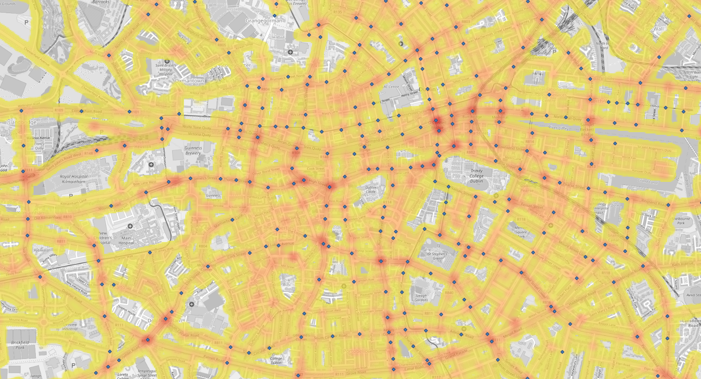

# airqualitydatahack-2023

## crashlanding into datahacking (Dublin City)

1. Install QGIS (curently latest version 3.28)
    1. You may need to install python 3 and corresponding libs
2. Install plugins: QuickMapServices, QChainage
3. Download and unpack data sets
    1. SHP from https://data.smartdublin.ie/dataset/google-airview-data-dublin-city (road observations of PM2.5, NO2, etc)
    2. GeoJson from https://data.smartdublin.ie/dataset/traffic-lights-fcc1 (location of traffic lights)
4. Add map: Web -> QuickMapServices -> OSM -> OSM Standard
5. Add road observations: Layer -> Add Layer -> Add Vector Layer -> Select file -> AirView_DublinCity_Measurements_ugm3.shp -> Add -> Close
6. Add traffic lights: Layer -> Add Layer -> Add Vector Layer -> Select file -> dcc_traffic_signal_sites_20221130 -> Add -> Close
7. Set traffic lght icon to more visible: RMB on traffic light layer -> Properties 
    1. Size -> 2.0
    2. Symbols -> Diamond blue
8. Set PM2.5 data shown as heatmap: RMB on airview measurements layer -> Properties 
    1. Select heatmap from the top selector
    2. Radius -> 100 metres at scale
    3. Weight poinst by -> PM25_ugm3
    4. ColorRamp -> Edit Color Ramp: 1st color is transparent, 2nd, yelow at 0.1%, 3rd orange at 10%, last red at 100% (this will make heatmap transparent when no data). Remember, pm2.5 is harmful in any concentration, so our colors start from yellow instead of green.
    5. Set layer rendering -> Opacity 70%
9. You could get maps as shown below. 

